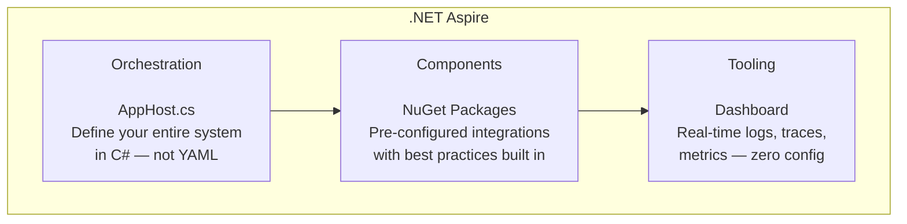
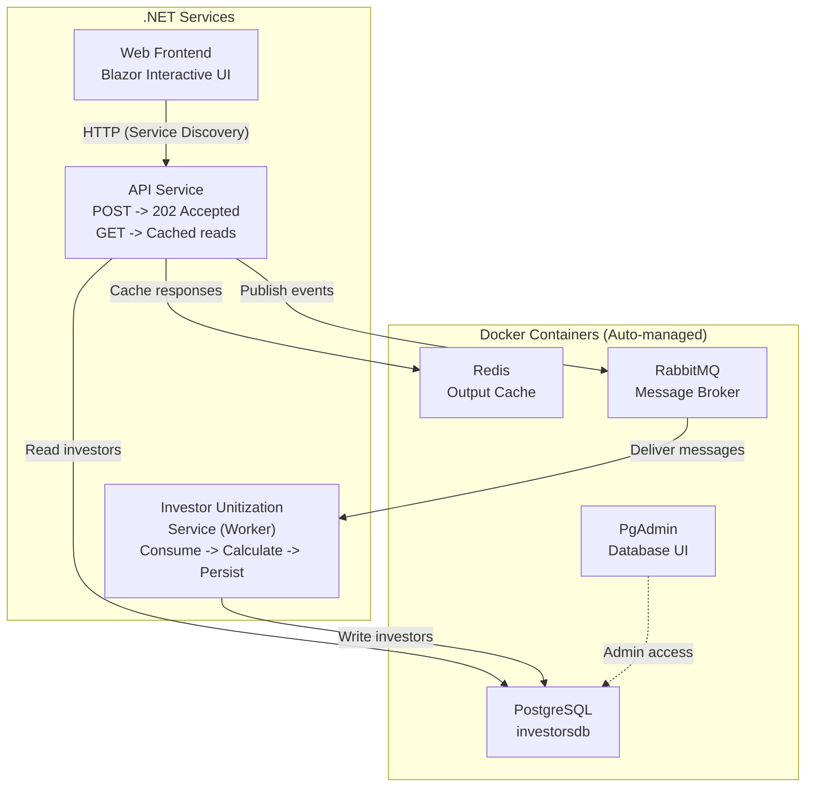
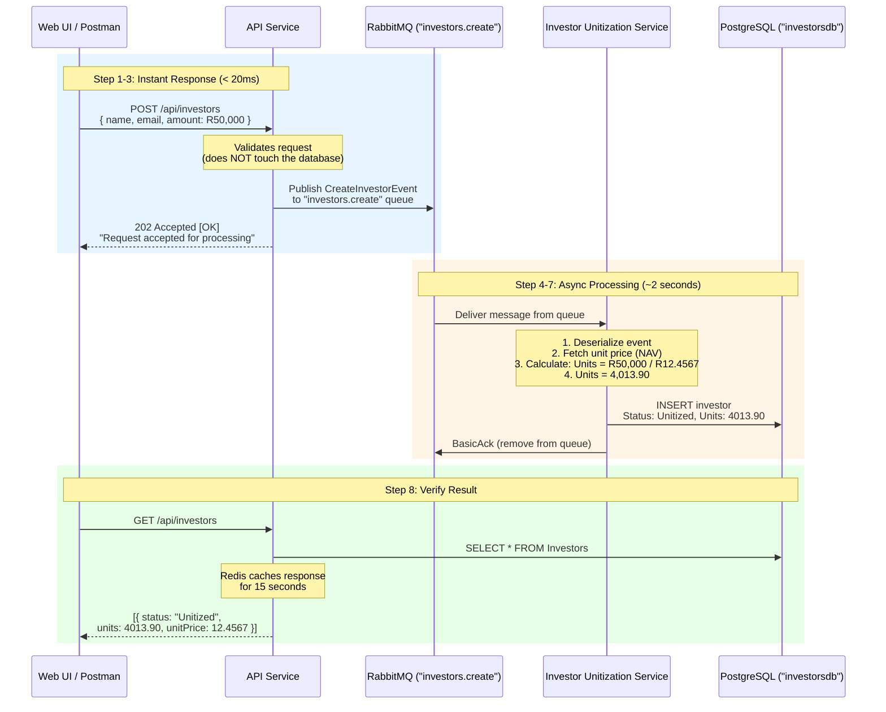
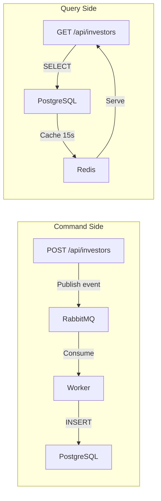
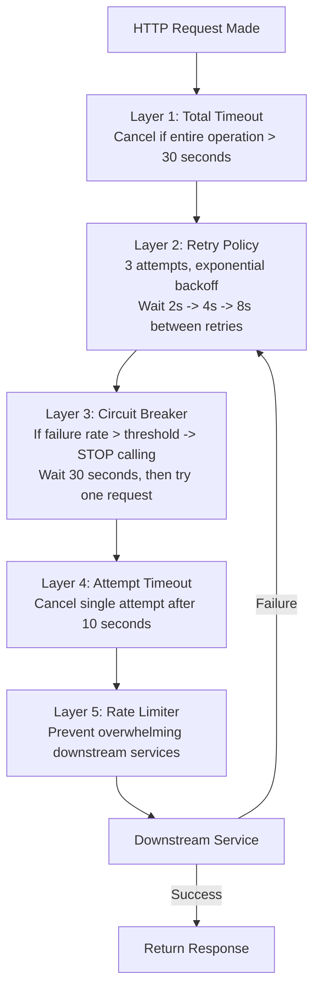
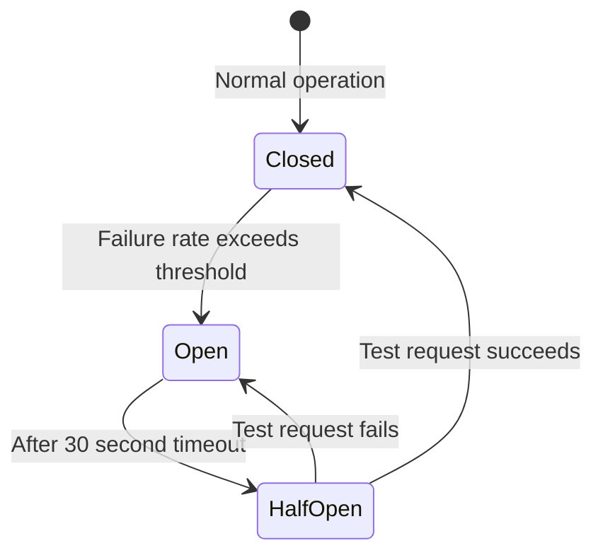

# .NET Aspire
## Building Cloud-Native Distributed Applications
### Investor Unitization POC & Resilience Architecture

---

*Norman Fwamba | August 2026*

---

---

# What I'll Cover Today

| # | Topic | What You'll Learn |
|---|-------|-------------------|
| 1 | **The Problem** | Why distributed systems are hard to develop locally |
| 2 | **What is .NET Aspire?** | The 3 pillars — Orchestration, Components, Tooling |
| 3 | **The AppHost** | How 40 lines of C# replace 500 lines of YAML |
| 4 | **Architecture** | Async event-driven investor registration with CQRS |
| 5 | **LIVE DEMO 1** | Submit an investor -> RabbitMQ -> Worker -> Database |
| 6 | **Resilience & Health Checks** | Polly retry, circuit breakers, chaos engineering |
| 7 | **LIVE DEMO 2** | Break the API on purpose and watch it heal itself |
| 8 | **Comparisons** | Aspire vs Docker Compose vs Kubernetes vs Dapr |
| 9 | **Lessons & Q&A** | Gotchas, best practices, and Q&A |

---

---

# Part 1: The Problem

---

## "OK, to run the project locally, you need to..."

```
Step 1:  Install PostgreSQL 16. Create a database called 'investorsdb'.
         Run the migration scripts in the correct order.

Step 2:  Install Redis. Make sure port 6379 isn't taken by another project.

Step 3:  Install RabbitMQ. Enable the management plugin.
         Set up a user with the right permissions.

Step 4:  Copy this 200-line docker-compose.yml.
         Pray nothing conflicts with your existing containers.

Step 5:  Create a .env file with 15 environment variables.
         Copy the connection strings exactly — one typo and nothing works.

Step 6:  Open 4 terminal windows. Start services in the correct order:
         Database first -> then API -> then Worker -> then Web.

Step 7:  If port 5432 is taken, update 3 configuration files.
```

### Time to first successful run: **2–4 hours**
*(if nothing goes wrong — and something always goes wrong)*

---

## The Daily Pain Points

| Pain Point | What Happens |
|-----------|-------------|
| **"Works on my machine"** | Different OS, different port bindings, different Postgres versions. One dev uses Docker, another has Postgres installed locally. Configs diverge. |
| **Silent failures** | API service crashes at startup because Redis isn't ready. Worker throws an exception but nobody sees it because logs are in a different terminal window. |
| **Connection string hell** | `Host=localhost;Port=5432;Database=investorsdb;Username=postgres;Password=...` — hardcoded in 3 different appsettings.json files. One typo = hours of debugging. |
| **No startup coordination** | Your API starts, tries to connect to Postgres, Postgres is still initializing -> crash. Manual restart. Every. Single. Time. |
| **Zero observability** | "Something is slow." Which service? Which database query? Which RabbitMQ consumer? You don't know. You docker logs, you grep, you guess. |
| **Cascading failures** | Database gets slow -> API threads block -> request queue backs up -> timeouts everywhere -> all services crash together. No retry logic. No circuit breakers. |

---

## What I Actually Wanted

```
[OK]  ONE command to start everything
         dotnet run --project AppHost

[OK]  Infrastructure spun up automatically
         Postgres, Redis, RabbitMQ — containers managed by Aspire

[OK]  Connection strings injected — zero config files
         .WithReference(postgres)  // That's it. No appsettings needed.

[OK]  Startup coordination
         .WaitFor(postgres)  // API waits until DB is actually healthy

[OK]  A single dashboard for ALL services
         Logs, traces, metrics — one screen, zero configuration

[OK]  Built-in resilience
         Retries, circuit breakers, timeouts — automatic via Polly
```

---

---

# Part 2: What is .NET Aspire?

---

## Definition

> **.NET Aspire** is an opinionated, cloud-ready stack for building
> **observable**, **production-ready**, **distributed** applications.
>
> It is **NOT** a framework. It is **NOT** a runtime.
> It is a set of tools and patterns that handle infrastructure plumbing
> so you can focus on your domain logic.

---

## The 3 Pillars



---

## Pillar 1: Orchestration (AppHost)

**One C# file defines your entire distributed system.**

| What You Write | What Aspire Does |
|----------------|------------------|
| `builder.AddPostgres("postgres")` | Pulls the Postgres Docker image, starts a container, generates credentials, configures health checks |
| `.WithPgAdmin()` | Spins up a PgAdmin container, auto-connects it to your Postgres instance |
| `.AddDatabase("investorsdb")` | Creates the database, generates the connection string |
| `builder.AddRedis("cache")` | Starts a Redis container, configures connection pooling |
| `builder.AddRabbitMQ("messaging")` | Starts RabbitMQ with auto-generated credentials |
| `.WithManagementPlugin()` | Enables the RabbitMQ management UI |
| `.WithReference(postgres)` | Injects the connection string into your service — zero config |
| `.WaitFor(postgres)` | Blocks service startup until Postgres passes its health check |

**Result: No YAML. No Dockerfiles. No .env files. No docker-compose. Just C#.**

---

## Pillar 2: Components (NuGet Integrations)

Each `Add___()` call gives you much more than just a connection:

```csharp
// This ONE line gives you:
builder.AddRabbitMQClient("messaging");

//   - Connection string auto-injected from AppHost
//   - Health check registered (Dashboard shows green/red)
//   - OpenTelemetry traces for every publish/consume
//   - Connection retry logic built in
//   - IConnection registered in DI as a singleton
```

### Available Components (100+)

| Category | Examples |
|----------|---------|
| **Databases** | PostgreSQL, SQL Server, MySQL, MongoDB, CosmosDB, Oracle |
| **Caching** | Redis, Garnet, Memcached |
| **Messaging** | RabbitMQ, Azure Service Bus, Kafka, NATS |
| **Storage** | Azure Blob, AWS S3, Minio |
| **Search** | Elasticsearch, OpenSearch |
| **Observability** | Seq, Grafana, Prometheus |
| **AI/ML** | Ollama, Azure OpenAI |

---

## Pillar 3: Tooling (The Dashboard)

### What you get — without writing ANY observability code:

| Feature | What It Shows | Without Aspire |
|---------|--------------|----------------|
| **Resource Health** | Live status of all containers & services (green/red) | Write custom scripts, check each container manually |
| **Structured Logs** | Searchable, filterable logs from ALL services in one view | docker logs service1, docker logs service2, grep... |
| **Distributed Traces** | The journey of a request across API -> RabbitMQ -> Worker -> DB with timing | Install Jaeger + OpenTelemetry SDK + configure exporters |
| **Metrics** | CPU, memory, GC pressure, HTTP request rates, error rates | Install Prometheus + Grafana + write dashboard configs |

### How it works — one line per service:

```csharp
// In your service's Program.cs:
builder.AddServiceDefaults();

// This single call configures:
//   - OpenTelemetry traces -> exported to Aspire Dashboard
//   - OpenTelemetry metrics -> exported to Aspire Dashboard
//   - Structured logging -> exported to Aspire Dashboard
//   - Health check endpoints (/health, /alive)
//   - Service discovery (resolve "api-service" -> localhost:port)
//   - Polly resilience pipeline for all HttpClients
```

---

---

# Part 3: The AppHost — The Orchestrator

---

## AppHost.cs — The Complete File

```csharp
var builder = DistributedApplication.CreateBuilder(args);

// -- Infrastructure ----------------------------------------------
// Aspire spins up containers automatically. No docker-compose needed.

var postgres = builder.AddPostgres("postgres")
    .WithPgAdmin()                    // Free DB admin UI
    .AddDatabase("investorsdb");      // Creates the database

var cache = builder.AddRedis("cache");  // Output caching for GET queries

var messaging = builder.AddRabbitMQ("messaging")
    .WithManagementPlugin();          // Free management dashboard

// -- Application Services ----------------------------------------
// Wired with automatic service discovery + connection string injection

var apiService = builder.AddProject<Projects.InvestorPortal_ApiService>("api-service")
    .WithReference(postgres)          // Connection string: auto-injected
    .WithReference(cache)             // Redis config: auto-injected
    .WithReference(messaging)         // RabbitMQ config: auto-injected
    .WaitFor(postgres)                // Don't start until DB is healthy
    .WaitFor(cache)
    .WaitFor(messaging);

var web = builder.AddProject<Projects.InvestorPortal_Web>("web-frontend")
    .WithExternalHttpEndpoints()
    .WithReference(apiService)        // Discovers API via "http://api-service"
    .WaitFor(apiService);

builder.AddProject<Projects.InvestorPortal_Worker>("investor-unitization-service")
    .WithReference(messaging)         // Consumes from RabbitMQ
    .WithReference(postgres)          // Writes to PostgreSQL
    .WaitFor(messaging)
    .WaitFor(postgres)
    .WaitFor(apiService);

builder.Build().Run();
```

### What This Orchestrates: 8 Resources



---

---

# Part 4: Architecture — Async Event-Driven Flow

---

## The Investor Unitization Flow



---

## Why 202 Accepted — Not 201 Created?

| HTTP Status | Meaning | When to Use |
|------------|---------|-------------|
| **201 Created** | "The resource **has been** created." | Synchronous — the database write is done before the response |
| **202 Accepted** | "Your request **has been accepted** for processing." | Asynchronous — processing happens later, result isn't ready yet |

In this architecture, when the API responds, the investor **does not exist in the database yet**.
The Worker creates it ~2 seconds later. Using 202 is the **correct HTTP semantics** for async operations.

---

## Why This Architecture? Side-by-Side Comparison

| Aspect | Synchronous (Traditional) | Async Event-Driven (My POC) |
|--------|---------------------------|-----------------------------|
| **What happens on POST** | API validates -> writes to DB -> calculates units -> returns 201 | API validates -> publishes event -> returns 202 |
| **API response time** | **Slow** — waits for DB + calculation (200-500ms) | **Instant** — just a queue publish (~15ms) |
| **Coupling** | API directly depends on DB schema, pricing engine, etc. | API only knows about the message queue |
| **If the database is slow** | API is slow. Clients time out. Everyone suffers. | Messages queue up safely. Worker processes when DB recovers. |
| **If unitization logic changes** | Modify the API. Redeploy the API. | Modify the Worker only. API unchanged. |
| **Adding new features** (e.g., send notification email after registration) | Modify the API to call email service. More coupling. | Add a new consumer on the same queue. Zero API changes. |
| **Scaling under load** | Must scale the entire API (including DB connections) | Scale Workers independently. API stays lightweight. |

---

## CQRS Pattern (Command Query Responsibility Segregation)



| | Command Side | Query Side |
|---|---|---|
| **Who** | Worker (Investor Unitization Service) | API Service |
| **Does what** | Consumes events -> processes -> **WRITES** to DB | Reads from DB -> caches in Redis -> returns to client |
| **Why separate** | Write logic can be complex, slow, independently scalable | Read path should be fast, cacheable, high-throughput |

---

---

# LIVE DEMO 1: Investor Unitization

---

## Demo Flow

```
1. Open the Aspire Dashboard -> Show all 8 resources are healthy (green)
2. Open the Web UI -> Navigate to Investors page
3. Submit an investor registration form
4. Watch the 202 Accepted response
5. See the investor appear in the table with Status: Unitized
6. Open Dashboard Traces -> Show the distributed trace across services
7. Open Dashboard Logs -> Show structured logs from the Worker
```

### Example POST Request (what I send):

```json
POST /api/investors

{
  "firstName": "Norman",
  "lastName": "Fonseca",
  "email": "norman@example.com",
  "idNumber": "9001015800085",
  "phone": "+27 82 123 4567",
  "initialInvestmentAmount": 50000
}
```

### Example 202 Response (what I get back immediately):

```json
HTTP 202 Accepted

{
  "message": "Investor creation request accepted for processing.",
  "investor": {
    "firstName": "Norman",
    "lastName": "Fonseca",
    "email": "norman@example.com",
    "status": "Pending",
    "initialInvestmentAmount": 50000,
    "submittedAt": "2026-08-25T14:00:55Z"
  }
}
```

### After ~2 seconds — GET /api/investors returns:

```json
HTTP 200 OK

[{
  "id": 1,
  "firstName": "Norman",
  "lastName": "Fonseca",
  "initialInvestmentAmount": 50000.00,
  "units": 4013.904164,
  "unitPrice": 12.456700,
  "status": "Unitized",
  "createdAt": "2026-08-25T14:00:55Z",
  "processedAt": "2026-08-25T14:00:57Z"
}]
```

**The math:** R50,000 / R12.4567/unit = **4,013.90 units** [OK]

---

## Dashboard Trace — What It Looks Like

```
POST /api/investors (api-service)                    [15ms]
|-- Validate request                                  [< 1ms]
|-- RabbitMQ Publish -> investors.create              [8ms]
\-- Return 202 Accepted                               [< 1ms]

investors.create (investor-unitization-service)      [1,800ms]
|-- RabbitMQ Consume                                  [2ms]
|-- Unitization Calculation                           [1,500ms]
|   \-- Units = 50000 / 12.4567 = 4013.904164
|-- PostgreSQL INSERT                                 [85ms]
\-- BasicAck -> Message removed from queue            [< 1ms]
```

> **Key insight:** The API returned in 15ms. The entire processing took 1.8 seconds.
> But the client didn't wait — that's the power of async event-driven architecture.

---

---

# Part 5: Resilience & Health Checks

---

## The Reality of Production Systems

> In production, **things fail**.
>
> - Databases become slow under load
> - Network connections drop randomly
> - Services restart during deployments
> - Third-party APIs return errors
>
> The question isn't **IF** failures happen.
> The question is **HOW** your system handles them.

---

## Aspire + Polly = Automatic Resilience

In `ServiceDefaults/Extensions.cs` — this is shared by ALL services:

```csharp
builder.Services.ConfigureHttpClientDefaults(http =>
{
    // ONE LINE — configures a 5-layer resilience pipeline
    // for EVERY HttpClient in EVERY service
    http.AddStandardResilienceHandler();
    
    // Also auto-configures service discovery
    http.AddServiceDiscovery();
});
```

### The 5-Layer Pipeline — What Happens to Every HTTP Request:



---

## Understanding Each Layer

### Retry with Exponential Backoff

```
Attempt 1: Call API -> [FAIL] 503 Service Unavailable
           Wait 2 seconds (+ random jitter)
Attempt 2: Call API -> [FAIL] 503 Service Unavailable
           Wait 4 seconds (+ random jitter)
Attempt 3: Call API -> [OK] 200 OK
           Return success to caller
```

**Why exponential backoff?** If the API is struggling, hammering it with immediate retries makes it worse. Backing off gives it time to recover.

**Why jitter?** If 100 clients all retry at exactly the same time, they'll overwhelm the API again. Random jitter spreads the retries out.

### Circuit Breaker — The Smart Safety Switch



> **State Details:**
> - **Closed**: All requests pass through normally. Failures are counted.
> - **Open**: ALL requests immediately rejected. No calls to downstream service. Protects the struggling service.
> - **Half-Open**: ONE test request allowed through. If it succeeds &rarr; circuit closes. If it fails &rarr; circuit stays open.

**Real-world analogy:** It's like a real electrical circuit breaker. When there's a power surge (too many failures), the breaker trips to protect the circuit (your downstream service). After the surge passes, the breaker resets.

---

## Deep Health Checks vs Standard Health Checks

| | Standard Health Check | Deep Health Check (My Custom) |
|---|---|---|
| **Endpoint** | `/health` (Aspire built-in) | `/api/investors/health-status` (I built this) |
| **What it checks** | "Is the app process running and responsive?" | "Can I actually query Postgres? How many investors are in the DB? Is RabbitMQ queue active? How many consumers are connected?" |
| **Response** | `Healthy` / `Unhealthy` (string) | Full JSON with per-dependency status, counts, and diagnostics |
| **When to use** | Load balancer probes, container orchestrator | Debugging, monitoring dashboards, operational visibility |

### Example Deep Health Response:

```json
GET /api/investors/health-status

{
  "postgres": {
    "status": "Healthy",
    "investorCount": 5
  },
  "rabbitmq": {
    "status": "Healthy",
    "queue": "investors.create",
    "messageCount": 0,
    "consumerCount": 1
  },
  "chaosMode": false,
  "timestamp": "2026-08-25T14:00:55Z"
}
```

---

---

# LIVE DEMO 2: Chaos Engineering & Circuit Breakers

---

## What I'm About to Do

```
1. Open the Resilience Demo page in the Web UI (/resilience)
2. Make a normal health check call -> 200 OK (everything works)
3. Turn ON Chaos Mode -> API starts failing 70% of requests
4. Fire a burst of 10 calls -> Watch retries and circuit breaker in action
5. Open Dashboard Traces -> See retry spans nested in traces
6. Turn OFF Chaos Mode -> Watch the circuit breaker recover
7. Make another call -> 200 OK (system healed itself)
```

### What Chaos Mode Does:

```csharp
// In the API — when chaos is enabled:
if (chaosEnabled && Random.Shared.NextDouble() < 0.7)
{
    // 70% of requests fail with 503
    return Results.StatusCode(503);
}
// 30% succeed normally
```

### What Polly Does Automatically (in the Web frontend):

```
Call 1:  API returns 503    -> Polly retries (attempt 1 of 3)
         Wait 2s + jitter
         API returns 503    -> Polly retries (attempt 2 of 3)
         Wait 4s + jitter
         API returns 200    -> [OK] Success! Client never knew about the failures.

Call 2:  API returns 503    -> Polly retries...
         API returns 503    -> Polly retries...
         API returns 503    -> [FAIL] All 3 attempts failed.
                            -> Failure recorded by circuit breaker.

Call 3:  Circuit breaker sees high failure rate
         -> CIRCUIT OPENS
         -> Request immediately rejected (no API call made)
         -> "BrokenCircuitException"
         -> Protects the struggling API from more traffic

         ...30 seconds pass...

         -> Circuit moves to HALF-OPEN
         -> One test request allowed through
         -> If chaos is off -> 200 OK -> Circuit CLOSES [OK]
```

---

---

# Part 7: Real-World Comparisons

---

## Aspire vs The Alternatives

| Feature | Docker Compose | Kubernetes | Dapr | **.NET Aspire** |
|---------|---------------|------------|------|-----------------|
| **Configuration** | YAML (verbose, error-prone) | YAML (very verbose — manifests, services, deployments, ingresses) | YAML + sidecar configs | **C# (type-safe, IntelliSense, compile-time checks)** |
| **Learning curve** | Medium | High (kubectl, Helm, namespaces, pods, services...) | High (components, sidecars, pub/sub abstractions) | **Low (it's just C# — you already know it)** |
| **Time to first run** | 15–30 min (write compose file, debug port conflicts) | 1–2 hours (install minikube, write manifests, debug networking) | 30–60 min (install CLI, configure components, init sidecars) | **2 minutes (`dotnet run --project AppHost`)** |
| **Connection strings** | .env files (manual, error-prone) | Secrets + ConfigMaps (complex) | Component YAML files | **Auto-injected (`.WithReference()`)** |
| **Service discovery** | DNS via Docker network | ClusterIP / CoreDNS | Sidecar proxy | **Built-in (`http://api-service` -> resolved automatically)** |
| **Distributed tracing** | Manual: install Jaeger, configure OpenTelemetry SDK, set exporters | Manual: install Jaeger Helm chart, configure sidecars | Built-in (via sidecar) | **Built-in (zero configuration — just works)** |
| **Health checks** | Manual: write curl scripts, custom healthcheck sections in YAML | Probes in YAML (livenessProbe, readinessProbe) | Component health status | **Automatic: all Aspire components register health checks** |
| **Resilience** | None built-in. Write your own retry/circuit breaker code. | Istio/Envoy service mesh (complex setup) | Built-in policies (via components) | **Built-in Polly (`AddStandardResilienceHandler()` — one line)** |
| **IDE integration** | None | Limited (lens, k9s are separate tools) | None | **Full: Visual Studio, Rider, VS Code — F5 to run, breakpoints work across services** |

---

## Case Study: Microsoft's eShop Migration

Microsoft's official reference architecture for microservices:

| Aspect | eShopOnContainers (Before Aspire) | eShop (After Aspire) |
|--------|-----------------------------------|----------------------|
| **Docker Compose** | ~500 lines of YAML | **0 lines** |
| **Custom Dockerfiles** | 12 Dockerfiles to maintain | **0 Dockerfiles** |
| **Environment config files** | 15+ .env and appsettings files | **0 config files** |
| **Observability setup** | Jaeger + Prometheus + Grafana (3 tools, hours to configure) | **Aspire Dashboard (1 tool, zero config)** |
| **Time to first run** | ~45 minutes | **Under 5 minutes** |
| **Total infra code** | ~1,500 lines | **~40 lines of C#** |

---

## My POC — What Aspire Saved Me

| Without Aspire (What I'd Need) | With Aspire (What I Have) |
|--------------------------------|---------------------------|
| `docker-compose.yml` (~80 lines) | **AppHost.cs** (~40 lines) |
| `.env` file with 15+ variables | **Nothing** (auto-injected) |
| 3 Dockerfiles (API, Worker, Web) | **Nothing** (Aspire builds projects) |
| Manual health check scripts | **Automatic** (built into components) |
| Jaeger + config for tracing | **Automatic** (ServiceDefaults) |
| Custom Polly configuration per service | **Automatic** (`AddStandardResilienceHandler`) |
| Multiple terminal windows for logs | **One Dashboard** for everything |

---

---

# Part 8: Lessons Learned

---

## Gotchas I Discovered & Solved

| Problem | Why It Happened | How I Fixed It |
|---------|----------------|-----------------|
| **API crashed on startup** | `EnsureCreatedAsync()` ran before Postgres was fully accepting connections, even with `.WaitFor()` | Added **retry logic** — 5 attempts with 3-second delays around the DB initialization |
| **DbContext injection failed in Worker** | Worker is a `BackgroundService` (singleton). DbContext is scoped. Can't inject scoped into singleton. | Used `IServiceScopeFactory` — create a new DI scope per message processed |
| **RabbitMQ connection exhaustion** | Creating new `IConnection` per request would exhaust TCP connections | Aspire injects `IConnection` as singleton. I create lightweight `IChannel` per operation (channels are cheap, connections are expensive) |
| **Port changes every restart** | Aspire allocates random ports dynamically | Used **service discovery**: `http://api-service` resolves automatically. Never hardcode ports. |
| **Docker Desktop sleeping** | "Virtualization not detected" after Windows Resource Saver mode | `bcdedit /set hypervisorlaunchtype auto` + restart |

---

## Best Practices

| Practice | Why |
|----------|-----|
| **Always use `.WaitFor()`** | Prevents startup race conditions between services and their dependencies |
| **Use `BasicAck` manually** (not `autoAck: true`) | If your Worker crashes mid-processing, `autoAck` loses the message. Manual ack means unprocessed messages go back to the queue. |
| **Use structured logging** with named parameters | `logger.Log("Processing {Name} for {Amount:C}", name, amount)` — searchable and filterable in Dashboard |
| **Set `prefetchCount: 1`** for RabbitMQ workers | Prevents one fast worker from hogging all messages. Enables fair load balancing across multiple worker instances. |
| **Add retry logic** to database initialization | Defense in depth — even with `.WaitFor()`, network timing can cause brief unavailability |
| **Use `IServiceScopeFactory`** in singleton services | The correct pattern for accessing scoped services (like DbContext) from a singleton (like BackgroundService) |

---

---

# Key Takeaway

---

## What Aspire Gives You

| Metric | My POC Value |
|--------|--------------|
| **Infrastructure code** | 40 lines of C# (AppHost.cs) |
| **Configuration files** | 0 |
| **Services orchestrated** | 3 .NET projects + 4 containers = 8 resources |
| **API response time** | ~15ms (202 Accepted, no DB write) |
| **Worker processing time** | ~1.8 seconds (unitization + DB persist) |
| **Observability setup** | 0 lines (all automatic) |
| **Resilience setup** | 1 line (`AddStandardResilienceHandler`) |
| **Load test results** | 2,630 requests, p95: 10ms, 0.07% error rate |

---

> ## Aspire doesn't make your architectural decisions.
>
> You still design your services.
> You still choose your patterns — CQRS, event-driven, microservices.
>
> **Aspire eliminates the infrastructure boilerplate
> so you can focus on what matters: your domain logic.**

---

---

# Q&A

---

## Try It Yourself

```powershell
# Clone or open the repo, then:
dotnet run --project D:\PROJECTS\InvestorPortal\src\InvestorPortal.AppHost\InvestorPortal.AppHost.csproj

# That's it. One command. Everything starts.
# Dashboard opens automatically at https://localhost:17034
# Web UI at http://localhost:{port}/investors and /resilience
# Postman collection in /postman folder (12 pre-built requests)
```

---

*Built with .NET 9 + .NET Aspire 13.4 | August 2026*
